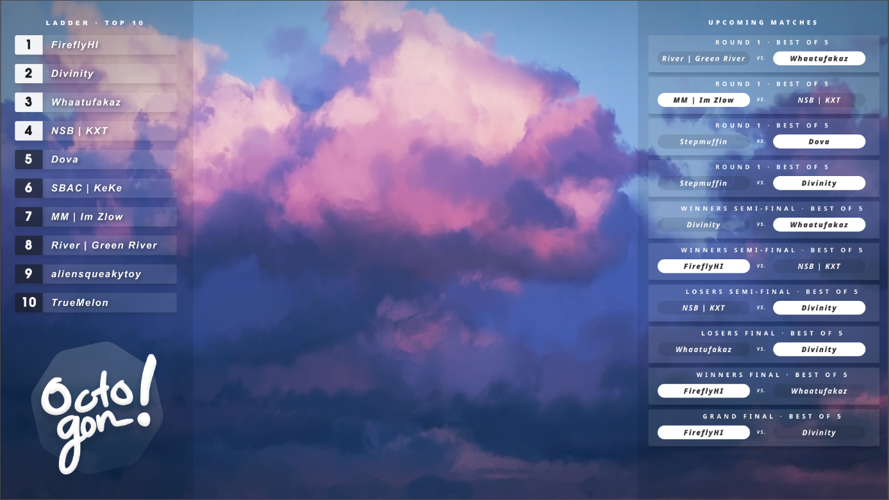

Octogon Panel
=============

super early stuff




## what is this?

This is an all-purpose streaming tool for esports tournaments.
while this was made for SSBM specifically, the codebase is being modeled such that supporting other games later is possible.

Current features:

- A scoreboard control GUI and overlays
- Smash.gg overlays
- Spotify overlays

## Downloads

Linux and Windows builds can be found on the [latest release](https://github.com/branden-akana/octogon-panel/releases).

For other platforms, see the [Running](https://github.com/branden-akana/octogon-panel#Running) section for instructions on how to build and run Octogon.

## Running and Building

### Setup

1. Install [Python 3](https://www.python.org/downloads/).
2. `git clone` this repository to a folder, or click the "Code" button on the top of this page, click "Download ZIP", and extract it to a folder.
3. Open a terminal in the folder (on Windows Explorer, Alt+D and type `cmd` in the address bar of the window).
4. Run `pip install -r requirements.txt`

Then, to run the program run `python main.py`.

To build the program, run `pyinstaller build.spec`. The executable should be located in the `dist` folder.

## Configuration

A `config.json` file will be created when this program is first run.
In this config you'll find a few options that are left blank.
You must set these manually for the Smash.gg integration to work.

`smashgg_api_key`: an API key required by Smash.gg to retrieve information from their servers.
You can create an API key through Smash.gg [here](https://smash.gg/admin/profile/developer).

`smashgg_tourny_slug`: the ID of your tournament from your Smash.gg tournament page.
For example, if the link to my tournament is `https://smash.gg/tournament/octo-gon-8`, then the slug is `octo-gon-8`.
This is used to retrieve the start date and time for the countdown layout.

`smashgg_event_id`: the ID of the event to retrieve bracket and standing information from.
You can find this by going into the settings for an event on Smash.gg.
For example, if the settings page for my event is `https://smash.gg/admin/tournament/octo-gon-8/event-edit/532752`, then the ID is `532752`.

To reload the configuration, please close and re-open the program.

## Usage

### 1. Adding layouts to OBS
This program runs a server that serves HTML pages when connecting to certain URLs.
This is intended for use with the "Browser" source in OBS.


Be default, this program serves webpages to `localhost:8000`.

Example source URLs:
```bash
# scoreboard source (to be used with the background source)
# recommended size: 1920x1080
localhost:8000/scoreboard
localhost:8000/background  # includes a mask cutout for gameplay capture

# smash.gg sources
# recommended size: 500x1080 (can adjust for wider or narrower display)
localhost:8000/standings
localhost:8000/countdown
localhost:8000/bracket

# spotify source (shows the current song and artist if playing music on Spotify)
# recommended size: 1920x100 (can adjust to make narrower, note the text might get cut off)
localhost:8000/spotify
```

The most up-to-date list of sources can be found in [server.py](https://github.com/branden-akana/octogon-panel/blob/master/octogon/daemon/server.py)

### 2. Controlling the Scoreboard

When run, you will see a window containing scoreboard controls.


Edit the information on the window, then update the scoreboard overlay by clicking "Update".

Note that the Smash.gg settings on the bottom of the window currently don't do anything.

### 3. Customizing

(Please note that the folder/file names are WIPs and may change at any time.)

#### Backgrounds

Backgrounds can be added into the `assets/bgs/` folder. At this time, only `assets/bgs/1.png` is loaded.

#### HTML/CSS

HTML templates are located in `templates/html`, which are rendered using Jinja2 when serving overlays.
SCSS files are used for styling, and can be found in `style/html`. These files are rendered automatically when they are modified.

#### Character Portraits

Character portraits can be found in `assets/portraits/`.
These can be changed as long as they use the same filenames, however note that currently only the
default color (`Default.png`) is used.

### 4. Troubleshooting

Having trouble with the app? Check the [Troubleshooting](https://github.com/branden-akana/octogon-panel/wiki/Troubleshooting-&-FAQ) page
to see if your problem is listed there.

If not, feel free to open an issue explaining the problem.

## Credits

BG from the screenshot: [link](https://dangerdrop.tumblr.com/post/165399672305/%E6%9A%81-akatsuki-%E9%9F%BF-hibiki)

Server made with `flask`\
GUI made with `pyqt5`\
HTML templating made with `jinja2`\
SCSS compiling made with `scss`\

and also, some GraphQL had to be written to interface with smash.gg's API.
